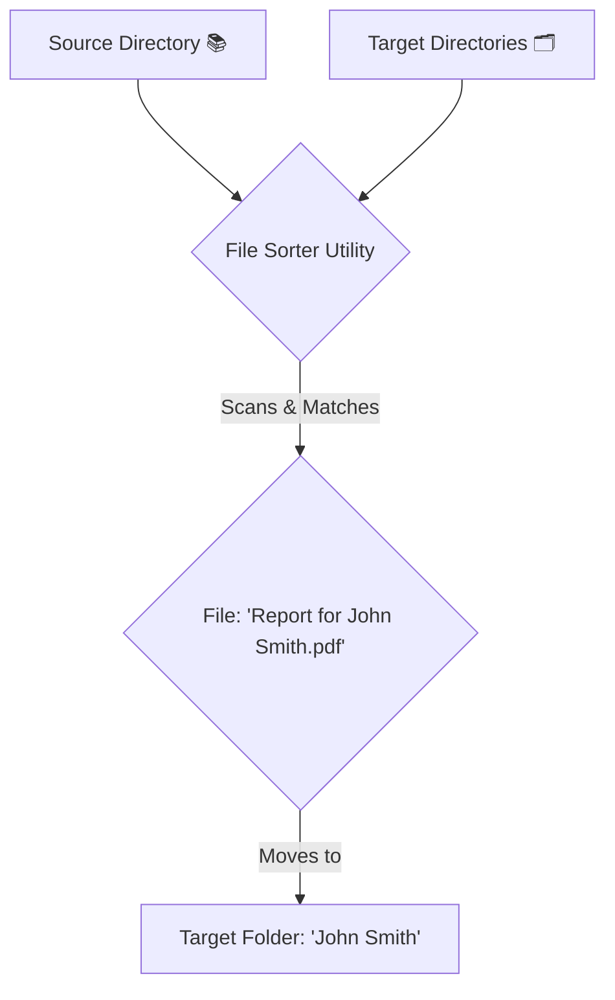

<div align="center">

# 📂 File Sorter Utility

**A smart command-line tool to automatically organize your files into categorized folders.**


[Русская версия](README.ru.md)

</div>

---

## 📜 Table of Contents

1. [Features](#-features)
    - [Functionality](#functionality)
    - [How It Works](#how-it-works)
    - [Use Cases](#use-cases)
2. [Prerequisites](#-prerequisites)
3. [Dependencies](#-dependencies)
4. [Usage](#-usage)
    - [Command-line Options](#command-line-options)
    - [Using a Pre-compiled Release (Recommended)](#using-a-pre-compiled-release-recommended)
    - [Building from Source](#building-from-source)
    - [Generating Test Data](#generating-test-data)
5. [Debugging](#-debugging)
6. [Advanced Logic & Behavior](#-advanced-logic--behavior)
7. [Exit Codes](#-exit-codes)
8. [For Developers](#-for-developers)
    - [Testing Strategy](#testing-strategy)
    - [Build & Release Automation](#build--release-automation)
9. [Disclaimer](#-disclaimer)

## ✨ 1. Features
### Functionality
*   🎯 **Intelligent Name Parsing**: Automatically extracts one or more names from target folder names (e.g., "John Smith" or "Anna Karenina, Leo Tolstoy").
*   🔍 **Recursive File Scanning**: Deep-scans a source directory and all its subdirectories to find every file that needs sorting.
*   🤖 **Smart Matching Logic**: Matches files to target folders by checking if the filename contains any associated name variants.
*   🛡️ **Pre-run Safety Checks**: Detects duplicate names across target folders and asks for user confirmation before proceeding, preventing incorrect sorting.
*   🤝 **Interactive Conflict Resolution**: If a file already exists at the destination, it provides clear choices:
    *   **Rename**: Move the new file with a suffix (e.g., `file_duplicate_001.txt`).
    *   **Skip**: Do not move the file.
    *   **Rename All**: Automate renaming for all future conflicts in the session.
*   🤔 **Ambiguity Resolution**: If a file matches multiple folders, it helps you decide:
    *   Choose the correct destination from a smartly sorted list.
    *   Skip the current file or all future ambiguous files.
*   ℹ️ **Built-in Help**: Get a quick overview of commands and options right from the terminal with the `-h` flag.
*   🧪 **Built-in Test Data Generator**: Quickly set up a test environment with a single command.

### How It Works

The utility follows a simple and powerful workflow to organize your digital clutter.



### Use Cases

| **For...** | **Use Case** | **Example** |
| :--- | :--- | :--- |
| **Accountants & Lawyers** | Sort client documents into individual folders. | `Invoice - John Doe.pdf` → `\John Doe\` |
| **Photographers** | Organize photoshoots by client or event name. | `Emily & David Wedding-001.jpg` → `\Emily & David Wedding\` |
| **Researchers** | Arrange papers and data by author or study. | `Analysis by Dr. Smith.xlsx` → `\Dr. Smith\` |
| **Personal Use** | Clean up a messy "Downloads" folder. | `Vacation Photo (Anna).png` → `\Anna\` |

## 📋 2. Prerequisites

*   .NET 9 SDK or later.

## 🔗 3. Dependencies

This project has **no external third-party dependencies**. It relies exclusively on the built-in libraries provided with the .NET 9 SDK.

## 🛠️ 4. Usage

This section covers two ways to use the utility: running a pre-compiled release and building from source.

### Command-line Options

| Option | Alias | Description |
| :--- | :--- | :--- |
| `<target_path> <source_path>` | | The main arguments specifying the target and source directories. |
| `--setup-test-data` | | Generates a set of test folders and files. |
| `--help` | `-h` | Displays the help screen with usage information. |
| `--verbose` | | Enables detailed error logging, including full exception stack traces for debugging. |

### Using a Pre-compiled Release (Recommended)

This is the easiest way for most users.

1.  Go to the project's **Releases** page.
2.  Download the latest version for your operating system (e.g., `file-sorter-win-x64.zip`).
3.  Extract the archive to a convenient location.
4.  Open a terminal in that folder and run the executable, passing the required arguments.

**On Windows:**
```bash
.\file_sort.exe "<path_to_target_folders>" "<path_to_source_files>"
```

**On Linux/macOS:**
```bash
./file_sort "<path_to_target_folders>" "<path_to_source_files>"
```

### Building from Source

This method is for developers who want to modify the code.

1.  Clone the repository:
    ```bash
    git clone https://github.com/shtormish/file_sort.git
    cd file_sort
    ```
2.  Build the application. This command will create an executable in the `bin/Release/net9.0/` directory:
    ```bash
    dotnet build -c Release
    ```
3.  Run the compiled application:

    **On Windows:**
    ```bash
    .\bin\Release\net9.0\file_sort.exe "<path_to_target_folders>" "<path_to_source_files>"
    ```

    **On Linux/macOS:**
    ```bash
    ./bin/Release/net9.0/file_sort "<path_to_target_folders>" "<path_to_source_files>"
    ```

    Alternatively, for quick development and testing, you can use the `dotnet run` command:
    ```bash
    dotnet run -- "<path_to_target_folders>" "<path_to_source_files>"
    ```

### Generating Test Data

To create the `temp1` (targets) and `temp2` (sources) directories for testing, run the application with the `--setup-test-data` flag.

> **Note:** The double dash `--` is necessary to ensure the argument is passed to the application and not interpreted by the `dotnet` command itself.

```bash
dotnet run -- --setup-test-data
```

## 🐛 5. Debugging

*   **Paths**: Ensure that all directory paths are correct. If a path contains spaces, it must be enclosed in double quotes (`"`).
*   **Console Output**: The application provides detailed, real-time feedback in the console for every operation: scanning, moving, skipping, and any conflicts or ambiguities encountered.
*   **Error Messages**: Clear error messages are printed for common issues such as "missing directories" or file system access errors (e.g., insufficient permissions).

## 🧠 6. Advanced Logic & Behavior

The utility employs several smart rules to ensure accurate sorting:

*   **Most Specific Match Wins**: If a file name matches multiple folders (e.g., a file `Report for Project X.pdf` could match folders `Project` and `Project X`), the utility will always choose the longest, most specific match (`Project X`). This prevents ambiguity and ensures files go to the correct sub-project.
*   **Spaceless Matching**: The matching logic ignores spaces. A file named `Report for JohnSmith.pdf` will correctly match a folder named `John Smith`.

## 🚦 7. Exit Codes

The application uses standard exit codes, which can be useful for scripting and automation.

| Code | Meaning |
| :--- | :--- |
| `0` | Success. The operation completed without fatal errors. |
| `1` | Error. The operation was terminated due to an error (e.g., invalid arguments, missing directories, or a user-initiated abort). |

## 🧑‍💻 8. For Developers

This project is built with testability and automation in mind.

### Testing Strategy
The project has a comprehensive test suite divided into two layers:
*   **Unit Tests**: Use `xUnit` and `Moq` to test the core `FileSorter` logic in complete isolation from the file system and console.
*   **Integration Tests**: Use `xUnit` to run the application's `Main` method end-to-end, testing CLI argument parsing, user interaction flows, and real file system operations in a temporary, isolated environment.

### Build & Release Automation
The release process is fully automated with **GitHub Actions**.
*   **Trigger**: A new release is built and published automatically whenever a new tag matching the `v*.*.*` pattern is pushed to the repository.
*   **Cross-Platform Builds**: The workflow compiles self-contained executables for Windows, Linux, and macOS.
*   **Automatic Versioning**: The version number is extracted from the git tag and injected into the assembly, ensuring the version displayed by `--help` is always accurate.
*   **Release Notes**: Release notes are automatically generated from the commit history since the last tag.

## ⚠️ 9. Disclaimer

Please note that this project was brought to life with the help of Gemini Code Assist, which served as a valuable partner in brainstorming solutions and writing code. While this tool is functional, it should be considered a proof-of-concept and has not been subjected to exhaustive testing across all possible scenarios and edge cases. Therefore, it is strongly recommended that you do not use this utility for sorting critical, sensitive, or irreplaceable data without first thoroughly reviewing the code and conducting your own tests. Think of it as a helpful assistant for casual organization, not a robust archival system for mission-critical files.
