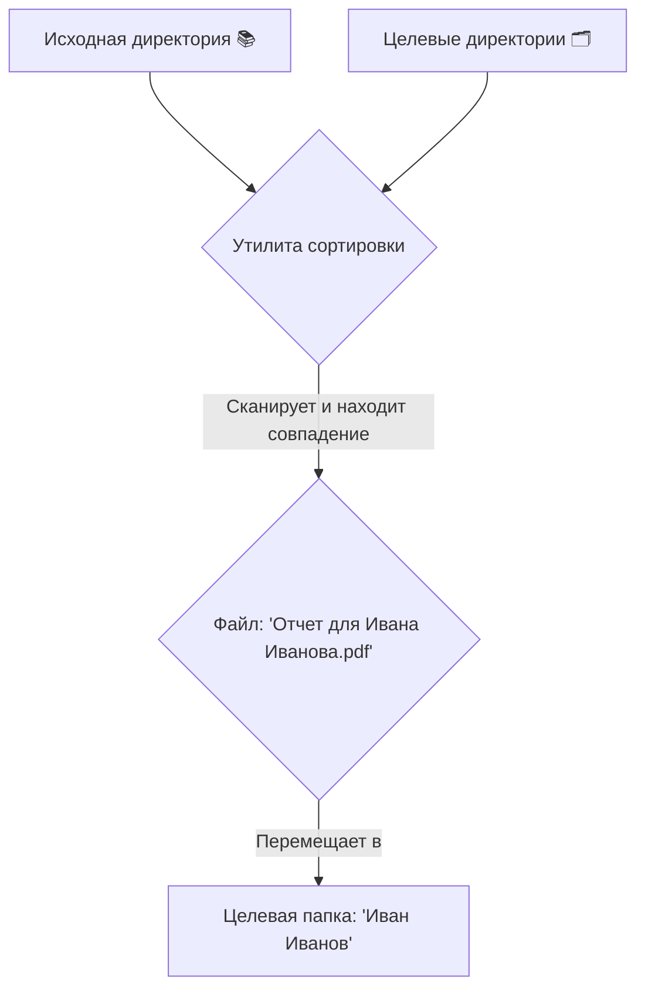

<div align="center">

# 📂 Утилита для сортировки файлов

**Умный консольный инструмент для автоматической организации ваших файлов по папкам.**


</div>

---

## ✨ Функциональность

*   🎯 **Интеллектуальный анализ имен**: Автоматически извлекает одно или несколько имен из названий целевых папок (например, "Иван Иванов" или "Анна Каренина, Лев Толстой").
*   🔍 **Рекурсивное сканирование**: Глубоко сканирует исходную директорию и все ее подпапки, чтобы найти каждый файл, требующий сортировки.
*   🤖 **Умное сопоставление**: Находит совпадения между файлами и папками, проверяя, содержит ли имя файла один из вариантов имени, связанного с папкой.
*   🛡️ **Проверки безопасности**: Перед запуском обнаруживает дубликаты имен в целевых папках и запрашивает подтверждение пользователя, предотвращая некорректную сортировку.
*   🤝 **Интерактивное разрешение конфликтов**: Если файл с таким же именем уже существует в папке назначения, программа предлагает понятный выбор:
    *   **Переименовать**: Переместить новый файл с добавлением суффикса (например, `file_duplicate_001.txt`).
    *   **Пропустить**: Не перемещать данный файл.
    *   **Переименовать все**: Автоматизировать переименование для всех будущих конфликтов в рамках сессии.
*   🤔 **Разрешение неоднозначностей**: Если файл подходит для нескольких папок, утилита помогает принять решение:
    *   Выбрать правильную папку из умным образом отсортированного списка.
    *   Пропустить текущий файл или все последующие неоднозначные файлы.
*   ℹ️ **Встроенная справка**: Получите краткий обзор команд и опций прямо в терминале с помощью флага `-h`.
*   🧪 **Встроенный генератор тестов**: Позволяет быстро создать тестовую среду одной командой.

## 🚀 Как это работает

Утилита использует простой и мощный алгоритм для наведения порядка в вашем цифровом пространстве.



## 💡 Сценарии использования

| **Для кого** | **Задача** | **Пример** |
| :--- | :--- | :--- |
| **Бухгалтеры и юристы** | Сортировка документов по папкам клиентов. | `Счет - ООО Ромашка.pdf` → `\ООО Ромашка\` |
| **Фотографы** | Организация фотосессий по именам клиентов. | `Свадьба Ивана и Марии-001.jpg` → `\Свадьба Ивана и Марии\` |
| **Исследователи** | Упорядочивание статей и данных по авторам. | `Анализ от Д-ра Петрова.xlsx` → `\Д-р Петров\` |
| **Личное использование** | Наведение порядка в папке "Загрузки". | `Фото с отпуска (Анна).png` → `\Анна\` |

## 📋 Требования

*   .NET 9 SDK или новее.

## 🔗 Зависимости

Этот проект **не использует сторонние библиотеки** и внешние зависимости. Он полностью полагается на встроенные библиотеки, поставляемые с .NET 9 SDK.

## 🛠️ Использование

В этом разделе описаны два способа использования утилиты: запуск готовой скомпилированной версии и сборка из исходного кода.

### ⌨️ Опции командной строки

| Опция | Псевдоним | Описание |
| :--- | :--- | :--- |
| `<путь_к_целям> <путь_к_источникам>` | | Основные аргументы, указывающие на целевую и исходную директории. |
| `--setup-test-data` | | Генерирует набор тестовых папок и файлов. |
| `--help` | `-h` | Отображает экран справки с информацией об использовании. |

### ✅ 1. Использование готовой версии (рекомендуется)

Этот способ подходит для большинства пользователей.

1.  Перейдите на страницу **Релизы** проекта.
2.  Скачайте последнюю версию для вашей операционной системы (например, `file-sorter-win-x64.zip`).
3.  Распакуйте архив в удобное для вас место.
4.  Откройте терминал (командную строку) в этой папке и запустите исполняемый файл, передав ему необходимые аргументы.

**Пример для Windows:**
```bash
.\file_sort.exe "<путь_к_целевым_папкам>" "<путь_к_исходным_файлам>"
```

**Пример для Linux/macOS:**
```bash
./file_sort "<путь_к_целевым_папкам>" "<путь_к_исходным_файлам>"
```

### 🏗️ 2. Сборка из исходного кода

Этот способ подходит для разработчиков, которые хотят внести изменения в код.

1.  Клонируйте репозиторий:
    ```bash
    git clone https://github.com/shtormish/file_sort.git
    cd file_sort
    ```
2.  Соберите приложение. Эта команда создаст исполняемый файл в директории `bin/Release/net9.0/`:
    ```bash
    dotnet build -c Release
    ```
3.  Запустите скомпилированный файл:

    **В Windows:**
    ```bash
    .\bin\Release\net9.0\file_sort.exe "<путь_к_целевым_папкам>" "<путь_к_исходным_файлам>"
    ```

    **В Linux/macOS:**
    ```bash
    ./bin/Release/net9.0/file_sort "<путь_к_целевым_папкам>" "<путь_к_исходным_файлам>"
    ```

    В качестве альтернативы для быстрой проверки можно использовать команду `dotnet run`:
    ```bash
    dotnet run -- "<путь_к_целевым_папкам>" "<путь_к_исходным_файлам>"
    ```

### 🎲 Генерация тестовых данных

Чтобы создать директории `temp1` (целевые) и `temp2` (исходные) для тестирования, запустите приложение с флагом `--setup-test-data`.

> **Примечание:** Двойное тире `--` необходимо, чтобы аргумент был передан приложению, а не интерпретирован командой `dotnet`.

```bash
dotnet run -- --setup-test-data
```

## 🐛 Отладка

*   **Пути**: Убедитесь, что все пути к директориям указаны верно. Если путь содержит пробелы, он должен быть заключен в двойные кавычки (`"`).
*   **Вывод в консоль**: Приложение предоставляет подробную обратную связь в реальном времени в консоли для каждой операции: сканирование, перемещение, пропуск, а также для любых возникших конфликтов или неоднозначностей.
*   **Сообщения об ошибках**: Четкие сообщения об ошибках выводятся для распространенных проблем, таких как отсутствие директорий или ошибки доступа к файловой системе (например, недостаточные права).

## ⚠️ Отказ от ответственности

Обратите внимание, что этот проект был создан при поддержке Gemini Code Assist, который выступил ценным помощником в поиске идей и написании кода. Хотя этот инструмент является функциональным, его следует рассматривать как демонстрацию концепции, так как он не проходил исчерпывающего тестирования во всех возможных сценариях. В связи с этим настоятельно не рекомендуется использовать утилиту для сортировки критически важных, конфиденциальных или незаменимых данных без предварительного изучения кода и проведения собственных тестов. Считайте его полезным помощником для повседневной организации, а не надежной системой архивации для критически важных файлов.
